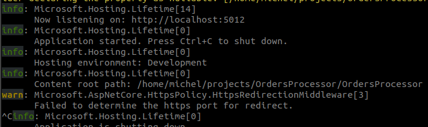
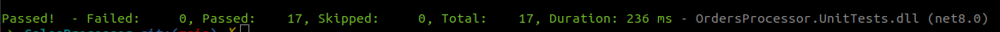

# Orders Processor API
[](https://app.getpostman.com/run-collection/1954140-7345cdfc-f428-4147-969b-35958d629c04?action=collection%2Ffork&source=rip_markdown&collection-url=entityId%3D1954140-7345cdfc-f428-4147-969b-35958d629c04%26entityType%3Dcollection%26workspaceId%3D0ccb7cc2-b18c-41ae-9e43-f7d2cce29a93#?env%5B%5BDOCKER%5D%20OrdersProcessor%5D=W3sia2V5IjoiYmFzZV91cmwiLCJ2YWx1ZSI6Imh0dHA6Ly9sb2NhbGhvc3Q6ODA4MC9hcGkvdjEiLCJlbmFibGVkIjp0cnVlLCJ0eXBlIjoiZGVmYXVsdCIsInNlc3Npb25WYWx1ZSI6Imh0dHA6Ly9sb2NhbGhvc3Q6ODA4MC9hcGkvdjEiLCJzZXNzaW9uSW5kZXgiOjB9XQ==)
# Description

This project provides a solution for parsing a sales record file and returning key data insights via a web API. The API processes the file and extracts essential information, allowing for quick analysis of sales data.

Problem Overview
The goal of the project is to create a Web API that can parse a sales record file and return an object containing the following details:

- Median Unit Cost: The middle value of all unit costs.
- Most Common Region: The region that appears the most frequently in the dataset.
- First and Last Order Date: The first and last dates of orders in the dataset, along with the number of days between them.
- Total Revenue: The sum of all revenue generated from the sales in the dataset.

# Features
- API Endpoint: The API provides a simple endpoint that accepts a sales record file (in a csv format), processes it, and returns the required information.
- Parsing: The file is parsed into an object, and the necessary fields are extracted and processed for analysis.
- Calculation: The API calculates the **median unit cost**, the **most common region**, **date difference**s, and **total revenue**.

# Design decisions

Check the project's [Wiki](https://github.com/michelpl/orders-processor/wiki/Design-Justifications) for more details.


# Api documentation
[Api documentation](https://documenter.getpostman.com/view/1954140/2sAYJ7fJow)

# Running the api locally

## Dependencies

*   ``Docker`` 27.4.1+
*   ``Docker Compose`` 1.23.1+
*   ``Dotnet SDK`` 8.0+ (only for local debugging or test running)

## Make sure the following ports are available in your server

*   ``Port 8080`` If you're running on docker
*   ``Port 5012`` If you're running locally

## Building the environment

Clone this repository

```bash
  git clone https://github.com/michelpl/orders-processor.git
```

Enter in repository folder

```bash
  cd orders-processor
```

Run docker compose up

```bash
  docker compose up -d
```

## The Orders Processors API will be available on
```bash
http://localhost:8080/api/V1
```

## Stoping services

```bash
  docker-compose down
```

## Building the environment manually (Dotnet SDK needed)

Clone this repository

```bash
  git clone https://github.com/michelpl/orders-processor.git
```

Enter repository folder

```bash
  cd orders-processor
```
Run Dotnet restore
```bash
   dotnet restore
```

Run the main project
```bash
  dotnet run --project OrdersProcessor/OrdersProcessor.csproj
```

## The Orders Processors API will be available on
```bash
  http://localhost:5012/api/v1
```



## Consuming the API

Run the API collection directly in your Postman app by clicking the button below:

[](https://app.getpostman.com/run-collection/1954140-7345cdfc-f428-4147-969b-35958d629c04?action=collection%2Ffork&source=rip_markdown&collection-url=entityId%3D1954140-7345cdfc-f428-4147-969b-35958d629c04%26entityType%3Dcollection%26workspaceId%3D0ccb7cc2-b18c-41ae-9e43-f7d2cce29a93#?env%5B%5BDOCKER%5D%20OrdersProcessor%5D=W3sia2V5IjoiYmFzZV91cmwiLCJ2YWx1ZSI6Imh0dHA6Ly9sb2NhbGhvc3Q6ODA4MC9hcGkvdjEiLCJlbmFibGVkIjp0cnVlLCJ0eXBlIjoiZGVmYXVsdCIsInNlc3Npb25WYWx1ZSI6Imh0dHA6Ly9sb2NhbGhvc3Q6ODA4MC9hcGkvdjEiLCJzZXNzaW9uSW5kZXgiOjB9XQ==)

Alternatively, check the [API documentation](
[Api documentation](https://documenter.getpostman.com/view/1954140/2sAYJ7fJow)
) for more information.


## Running unit tests

Run the following command in the repository folder:

```bash
  dotnet test
```

You can check the test results in your terminal:



## Function tests on Postman


## Performance tests

[Check real deshboard]([url](https://www.postman.com/crimson-satellite-2744/workspace/hiring-processes/run/performance/1efc702c-267f-46b0-9ea5-f6fe009669aa?static=true))


